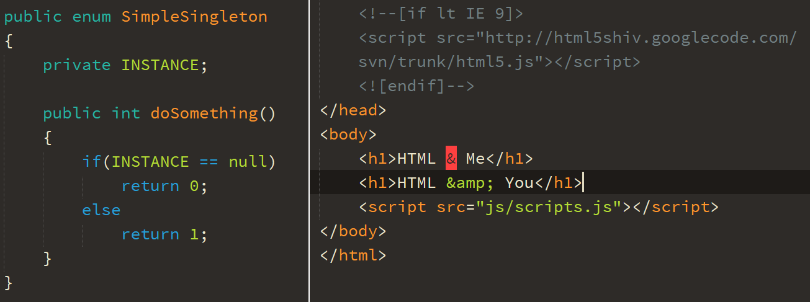
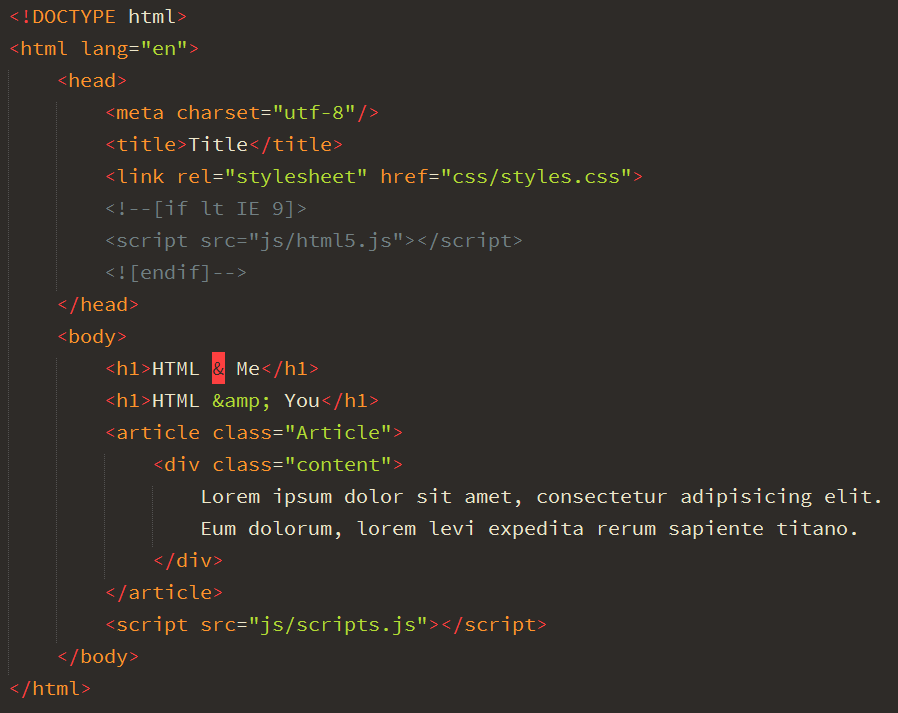
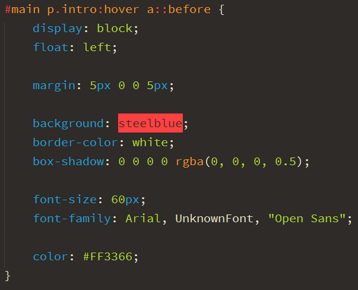
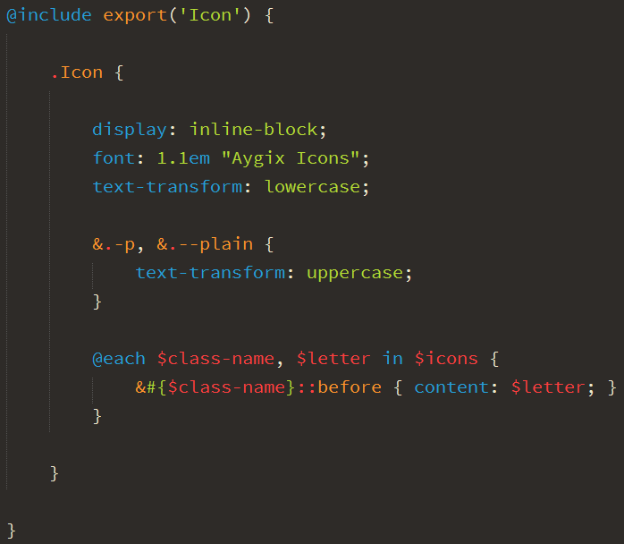

# Mars Peacock Sublime Color Scheme

Mars Peacock is a tiny dark syntax color scheme for Sublime Text. It's tweaked of Peacock theme.

## Install

This color scheme has been tested with Sublime Text 3 (build 3103).

To perform the installation: download `MarsPeacock.tmTheme` from this repository, then paste it into users package folder (`Preferences: Browse Packages` in command palette, then go to `User` folder).

## Preview

### Markdown

### HTML

### CSS

### SCSS

